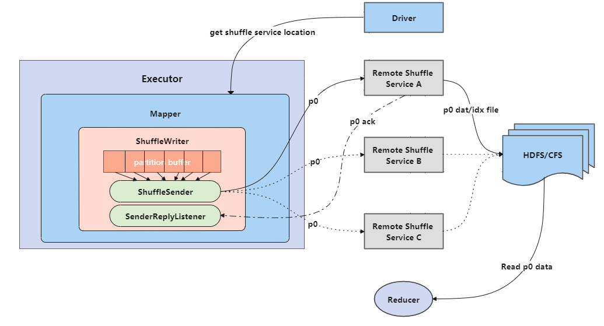

# RSS design doc

The OPPO Remote Shuffle Service(RSS) is designed as standalone service (not depend on Yarn NodeManager external shuffle service).
The goal of RSS is to change the small and random IO to sequence IO, result to improve the performance and  stablility of application.

RSS has four part : ShuffleMaster and ShuffleWorker.
The ShuffleMaster provide following functionalities:
 - manage shuffle workers:
   1. shuffle workers status monitoring and transferring
   2. shuffle workers load balance
   3. shuffle service cluster router
 - allocate shuffle workers to application
   1. response allocate shuffle workers request from application driver

The ShuffleWorker provide following functionalities:
 - accept data and checksum from maps shuffle writer
 - group and dump same partition data and checksum into same files
 - self-health check and upload status to ShuffleMaster
 - save shuffle data to distribute file system(HDFS/CFS/S3/Alluxio)
 - split large shuffle file to some small file

The ShuffleWriter provide following functionalities:
 - compress and serialize shuffle data, group data and checksum 
 - use Netty client send shuffle package to shuffle worker
 - switch new shuffle worker to send when sending failed
 
The ShuffleReader provide following functionalities:
 - read shuffle data and checksum from partition shuffle file async

## The basic design of RSS
The following architecture diagram illustrates how it works:

The basic work flow like following desc：

  1. shuffle manager send request to shuffle master for getting shuffle workers and configuration to use. 
  2. shuffle writer send data and checksum to shuffle worker asynchronous. When all map task finished, shuflfe worker assign the shuffle file as finalize status.
  3. shuffle worker group and dump all maps' same partition's data and checksum in one file to distribute file system
  4. shuffle reader read partition files，and check the checksum of data
  
The design for stability：
  1. use checksum check data from diff map to guarantee data correctness
  2. shuffle writer switch shuffle worker when sending data corrupted or time out
  3. flow control the map data sending speed to protect whole system stability

The disign for performance:
  1. shuffle writer save the package data size to a threshold for reduce sending packages 
  2. shuffle writer use direct memory to cache data
  3. shuffle writer serialize and compress data parallelization
  4. shuffle reader read data asynchronously and using pre-read mechanism
  5. shuffle worker process different partition data parallel using customized thread model
  6. shuffle worker buffered data to save flush data times
